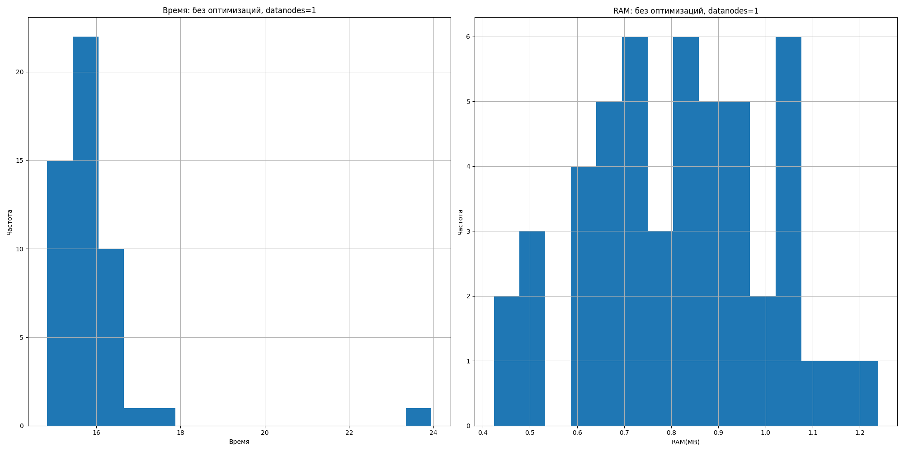
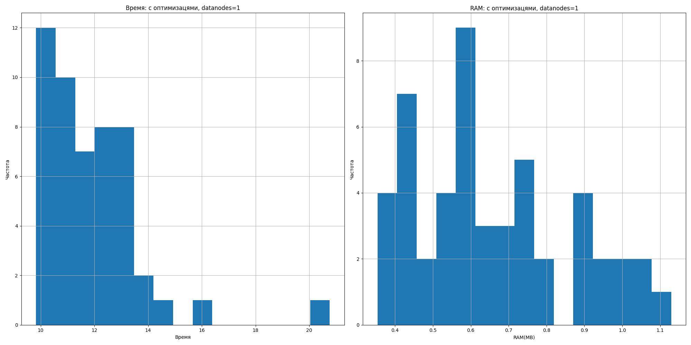
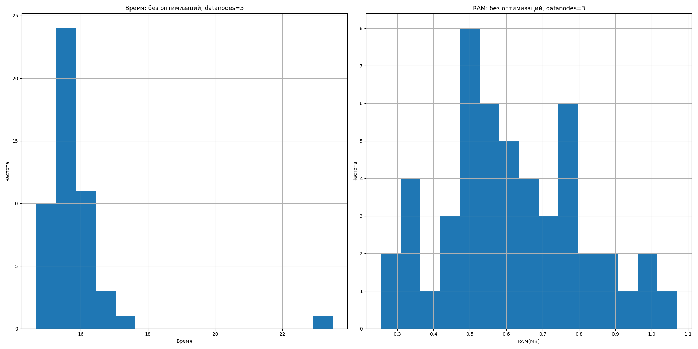
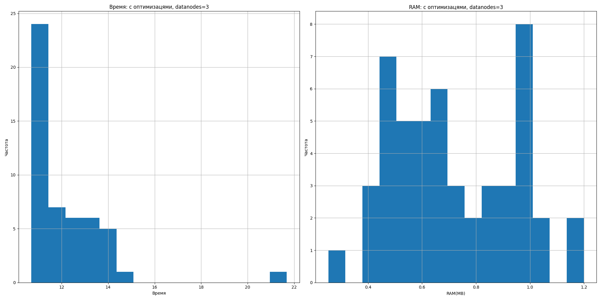

# HDFS-Lab
В данной работе реализован препроцессинг датасета https://www.kaggle.com/datasets/utkarshx27/real-estate-sales-2001-2021-gl, а также его кластеризация методом KMeans. Размер изначального датасета составляет 113 МБ. <br>
Данные размещаются в файловой системе Hadoop и обрабатываются при помощи технологий Spark.
## How to run
To run application please follow this steps:
### Building and putting files
Run the following code with defined <NODE_NUMBER> (1 or 3) to build containers
and put file to the filesystem:
```sh
    docker-compose -f docker-compose_<NODE_NUMBER>nd.yml up -d
    docker exec -it namenode /bin/bash
```
```sh
    hdfs dfs -put /mnt/data/data.csv /data.csv
```
### Run application

To run application example please run:
```sh
    docker exec -it spark-master spark-submit --master spark://spark-master:7077 application/main.py --data_nodes <NODE_NUMBER> [--enable_optims]
```

Arguments --enable_optims can enable pyspark optimizations. --data_nodes stands for number of used data nodes (1 or 3).

## Results



